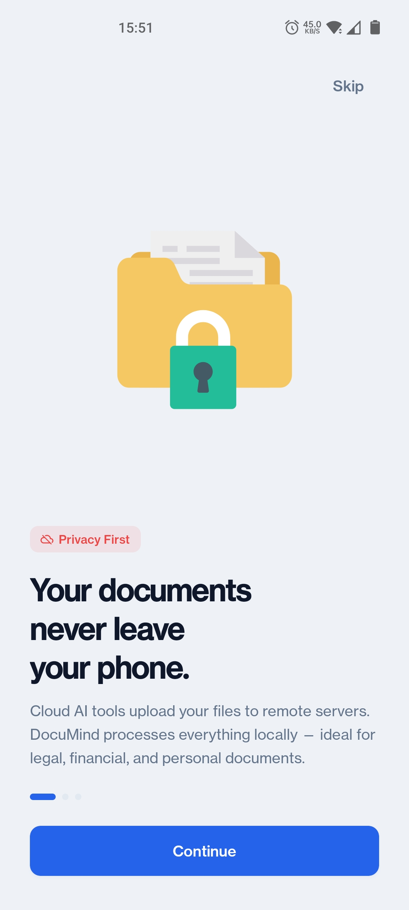
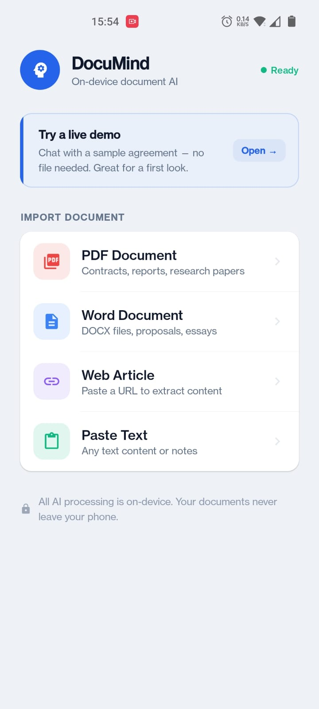
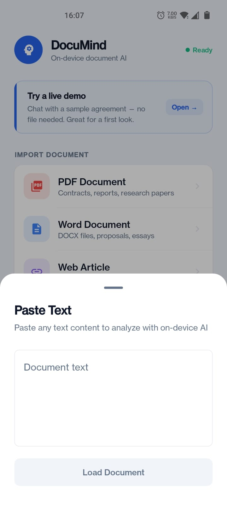
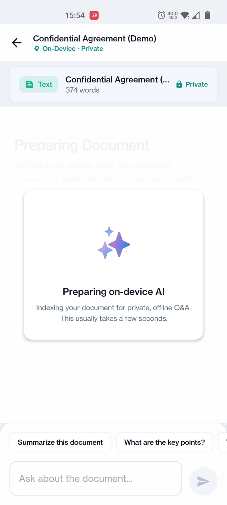
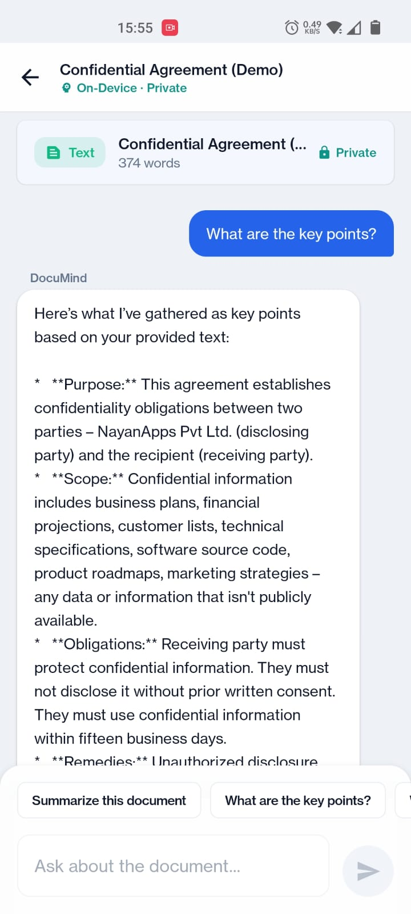

# DocuMind - AI Reading Assistant

An Android app that lets you chat with your documents using on-device AI. All processing happens locally on your phone - your documents never leave your device.

## Features

- **On-Device AI**: Uses Gemma 1B model via MediaPipe for intelligent Q&A
- **100% Offline**: Works without internet after initial model download
- **Privacy First**: Documents are processed locally, never uploaded
- **Multiple Sources**: Supports PDF, Word (DOCX), URLs, and pasted text
- **Smart Extraction**: Extracts and processes text from various document formats

## Screenshots

| Onboarding | Home | Paste text |
|------------|------|------------|
|  |  |  |

| Indexing (on-device) | Chat Q&A |
|----------------------|----------|
|  |  |

## Demo video


## Tech Stack

- **Language**: Kotlin
- **UI**: Jetpack Compose + Material 3
- **Architecture**: MVVM + Clean Architecture
- **AI**: MediaPipe Tasks GenAI (Gemma 1B)
- **Model Delivery**: Google Play Asset Delivery (fast-follow)
- **Document Parsing**:
  - PDF: PDFBox Android
  - Word: Apache POI
  - URL: Jsoup
- **Analytics**: Firebase Analytics + Crashlytics
- **Updates**: In-App Update API

## Project Structure

```
Documind/
├── app/
│   └── src/main/java/com/documind/app/
│       ├── data/
│       │   ├── analytics/      # Firebase Analytics
│       │   ├── extractor/      # PDF, DOCX, URL extractors
│       │   ├── fcm/            # Push notifications
│       │   ├── llm/            # LLM management
│       │   ├── processor/      # Text processing
│       │   └── update/         # In-app updates
│       ├── domain/
│       │   ├── model/          # Data models
│       │   └── usecase/        # Business logic
│       └── ui/
│           ├── components/     # Reusable UI components
│           ├── screens/        # App screens
│           ├── theme/          # Material theme
│           └── viewmodel/      # ViewModels
├── model_pack/                 # Asset pack for AI model
│   └── src/main/assets/
│       └── gemma3-1b-it-int4.task  # AI model (not in git, download from Kaggle)
└── gradle/
    └── libs.versions.toml      # Dependency versions
```

## Setup

### Prerequisites

- Android Studio Hedgehog or newer
- JDK 21
- Android SDK 36

### Build

1. Clone the repository:
```bash
git clone git@github.com:ramakrishna-sunkara/Documind.git
cd Documind
```

2. Download the Gemma 1B model:
   - Get `gemma3-1b-it-int4.task` (555MB) from [Kaggle](https://www.kaggle.com/models/google/gemma-3/tfLite)
   - Place it in `model_pack/src/main/assets/`

3. Add Firebase config:
   - Create a Firebase project
   - Download `google-services.json`
   - Place it in `app/`

4. Build:
```bash
./gradlew :app:assembleFreeDebug
```

### Release Build

```bash
./gradlew :app:bundleFreeRelease
```

The AAB will be at: `app/build/outputs/bundle/freeRelease/app-free-release.aab`

## Model Delivery

The AI model (~555MB) is delivered via Google Play Asset Delivery:

- **Delivery Type**: `fast-follow` - downloads automatically after app install
- **Fallback**: Users can manually trigger download from the Home screen
- **Offline**: Once downloaded, works completely offline

## Privacy

- All document processing happens on-device
- No documents or queries are sent to external servers
- Only anonymous analytics are collected (can be disabled)
- See [Privacy Policy](PRIVACY_POLICY.md)

## License

Copyright © 2024 Ram Apps. All rights reserved.

## Play Store Link

https://play.google.com/store/apps/details?id=com.documind.app

## Support

- Buy Me a Coffee: https://buymeacoffee.com/ramandroid
